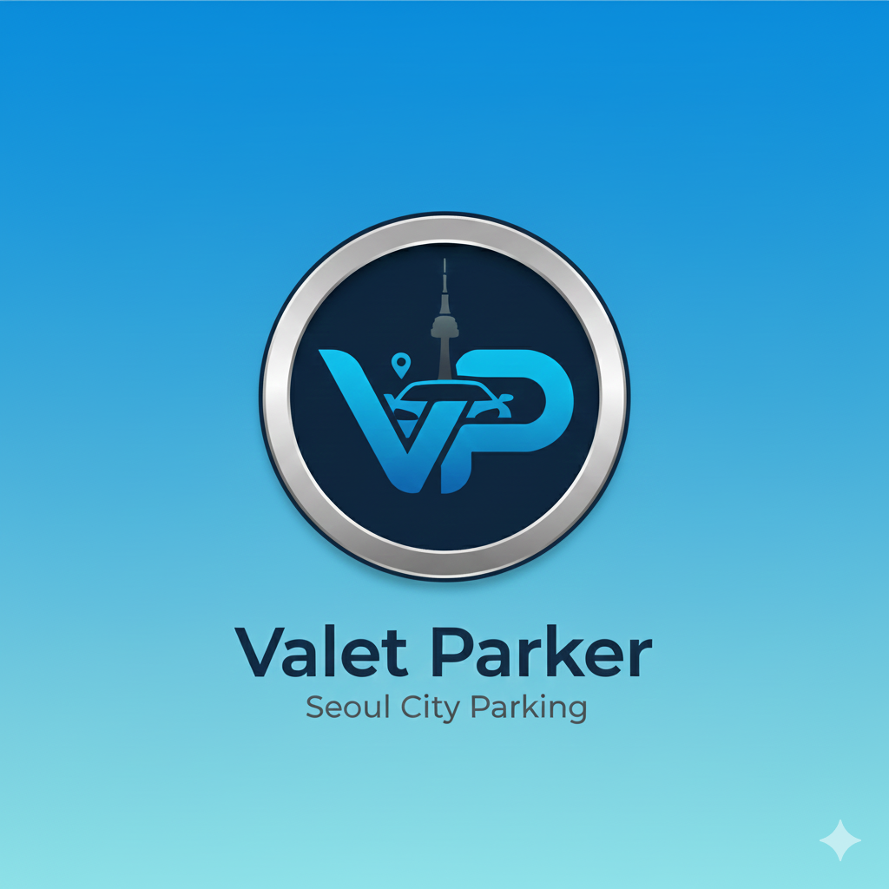
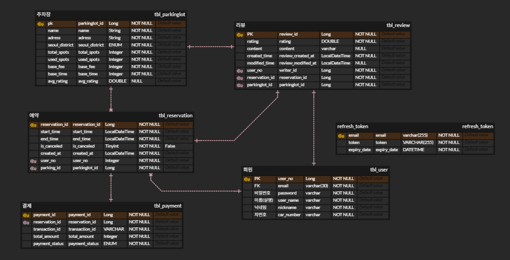
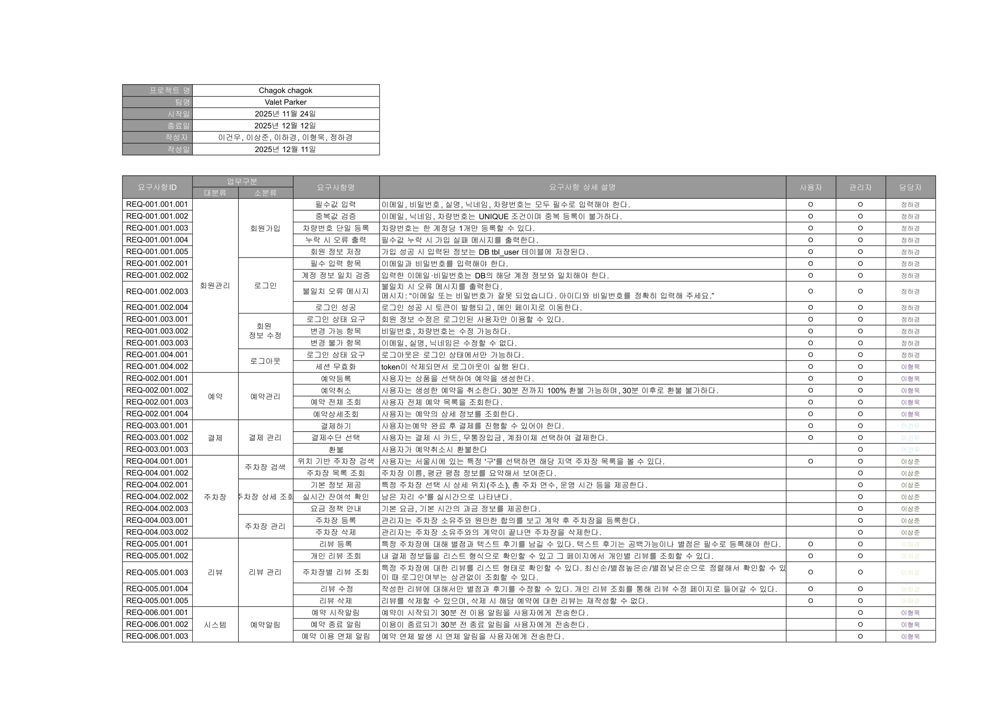
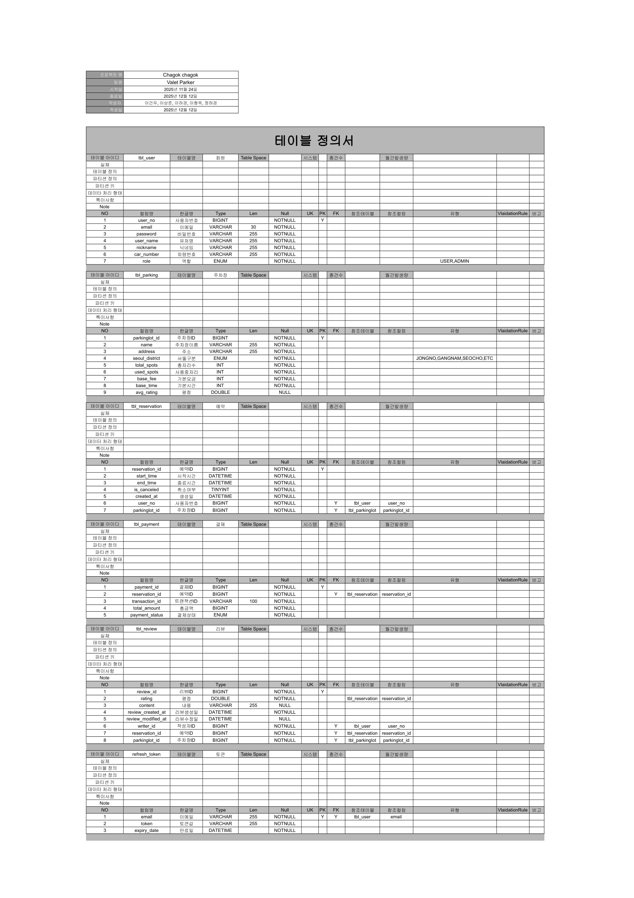
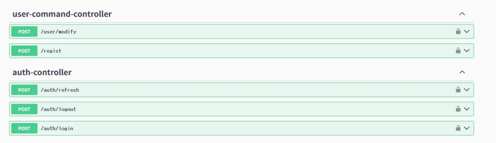
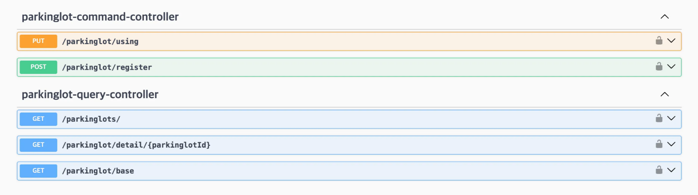
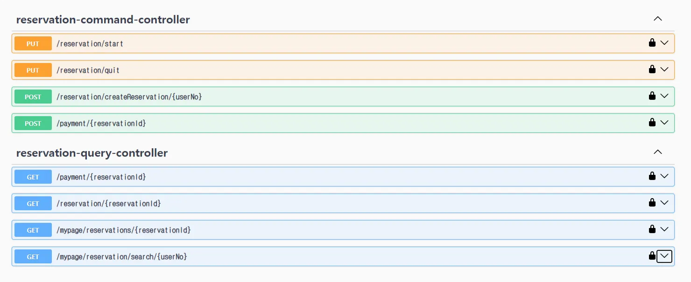
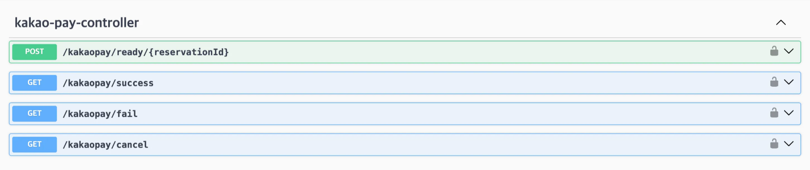
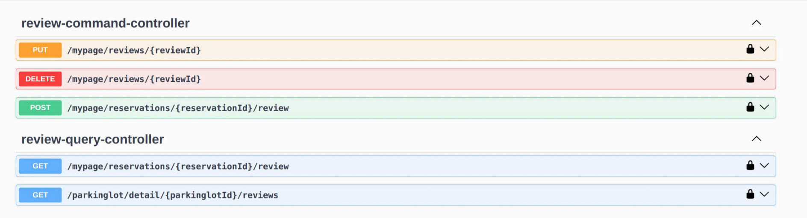

### Beyond SW 21th 2번째 단위 프로젝트

# 차곡🚘차곡🌾 (주차장 예약 시스템)

차곡차곡은 도시 내 부족한 주차 공간 문제를 해결하기 위해 설계된 **주차장 실시간 예약·조회 시스템**이다.
사용자는 주변 주차장을 검색하고, 요금정보를 확인한 뒤, 예약·결제까지 한 번에 처리할 수 있다.
또한 이용 후 리뷰를 작성해 다른 사용자에게 주차장 품질 정보를 제공한다.

***

## 팀원 정보

| 이름 | GitHub 아이디 | 프로필 링크 |
|------|----------------|--------------|
| 이형욱 | danielhw99 | https://github.com/danielhw99 |
| 이하경 | fijitlwkr | https://github.com/fijitlwkr |
| 정하경 | hathang16 | https://github.com/hathang16 |
| 이상준 | Ongsaem0 | https://github.com/Ongsaem0 |
| 이건우 | guntinue | https://github.com/guntinue |

***

## 주요 기능

### 1. 유저(User)

* 회원가입, 로그인
* 마이페이지(예약 내역, 결제 내역, 작성 리뷰 조회)

### 2. 주차장(Parking Lot)

* 위치 기반 주차장 검색
* 상세 정보 제공

  * 남은 자리 수
  * 요금 구조
  * 운영 시간
* 리뷰 평균 별점 표시

### 3. 예약(Reservation)

* 원하는 날짜/시간 기반 예약
* 예약 취소 기능
* 이용 완료 후 리뷰 작성 가능

### 4. 리뷰(Review)

* 사용자는 특정 주차장 이용 후 리뷰 작성 가능
* 다른 사용자 리뷰 조회 가능

### 5. 결제(Payment)

* 예약금으로 결제 진행

---

## 서비스 필요성

### 도심 주차 공간 부족 문제

국토교통부 자료에 따르면, 수도권 및 주요 도심 지역은 등록 차량 대비 주차 공간이 여전히 부족한 상황이다.
실제 이용자는 목적지 주변에 주차할 수 있는 공간이 있는지 알기 어려워 **시간 낭비**, **불필요한 이동**, **교통 혼잡 증가**가 발생한다.

### 기존 서비스의 한계

현재 제공되는 주차장 정보 서비스는 **예약 기능 부재**, **실시간 잔여 자리 부족**, **리뷰 기반 품질 정보 부족** 등의 문제가 존재한다.
사용자에게 필요한 정보와 실제 경험 기반 신뢰도를 동시에 제공하는 시스템의 수요가 증가하고 있다.

---

## 유사 서비스

### 카카오T 주차

* [https://parking.kakao.com](https://parking.kakao.com)
  주차장 조회·결제 기능을 제공하지만, 일부 지역에 한정되어 있거나, 리뷰 기반 품질 정보가 제한적이라는 한계가 있다.

---

## 핵심 가치

* **시간 절약**: 목적지 주변 주차장을 미리 확인하고 예약 가능
* **신뢰성**: 사용자 리뷰 기반으로 주차장 품질 정보 제공
* **편의성**: 검색 → 예약 → 결제 → 리뷰까지 원스톱 프로세스
* **투명성**: 요금 정보/운영 시간/자리 현황을 명확하게 제공

---

## 기술 스택 (Tech Stack)

### Backend

| 구분 | 기술 |
|------|------|
| Language | Java 17 |
| Framework | Spring Boot 3.x |
| Build Tool | Gradle |
| Architecture | MSA |
| Web | Spring Web (REST API) |
| Security | Spring Security (JWT 기반 인증, Header Authentication) |
| Data Access | Spring Data JPA |
| Database | MariaDB / MySQL |
| ORM | Hibernate |
| API Documentation | Swagger (Springdoc OpenAPI) |
| Inter-service Communication | OpenFeign |
| Testing | JUnit 5, Mockito, MockMvc |
| Version Control | Git / GitHub |

---

## 산출물
> <a href="https://docs.google.com/spreadsheets/d/1h9R_dw4q_j_GQRm_joBF7CifXKRKf4viOWXWShSHQqs/edit?usp=sharing">산출물 시트는 여기를 클릭해주세요.</a>

### MSA 구조도
> 

---

### ERD
> 

---

### WBS
> 

---

### 요구사항명세서
> 

---

### DDD 설계문서

 
DDD 문서

 
 
 
 
 
 
 
 
 

---

### 테이블정의서
> 

---

## API 명세서
### user service
> 

### parkinglot service
> 

### reservation service
> 

### payment service
> 

### review service
> 

---

## 소감문

| 이름 | 담당 역할 | 프로젝트 소감 |
|------|-----------|---------------|
| 이건우 | 결제 | 첫 데이터베이스 프로젝트와는 달리 프로젝트를 진행해오면서 점점 알아야할 내용이 많아져서 걱정했는데 팀원들과 함께 하면서 직접 부딪혀 보니 오히려 이론으로 공부 하는것 보다 더 습득하기 수월했던 시간이였다, 강사님께서 카카오페이 API를 추천해 주셔서 시도해보면서 머리가 복잡했지만 외부 API에 대해서도 공부해볼수 있는 시간이였고 성공했을때 성취감이 대단했다. 아쉬웠던 부분은 이번 프로젝트에선 본격적으로 깃허브를 사용해 보았는데 완벽하게 이해했다고 생각했었지만 아찔했던 순간이 몇번 있었다.. 협업을 위해서 공부를 더 해야겠다, 그리고 실행 되겠지라는 안일한 생각을 갖고 밀고 나가는것 보다 테스트코드와 디버깅하는 습관을 들여서 중간에 꼬이거나 하는일이 없도록 해야겠단 생각을 하게 되었습니다.  |
| 이상준 | 주차장 | 단위 프로젝트로 기획부터 DB설계 JPA, MSA등 수업시간에 새로 배운 내용을 사용해서 주차장 예약 시스템 프로젝트를 만들었는데, 처음에 요구사항 정의서를 작성하면서 “ 프로젝트 생각보다 쉽게 할 수 있겠다 ” 라는 생각을 했습니다. 하지만 실제 개발단계에 들어가면서 예상했던대로 쉽지만은 않았고, 처음 초기 기획을 단단하고 견고하게 작성해야 개발 도중 내용이 바뀌는 일이 없고, 끝까지 마무리할 수 있다고 생각했습니다. 1인분 하기도 조금 벅찼지만 팀이 계획한 내용을 그래도 잘 마무리할 수있어서 뿌듯하고 다음엔 실수하지 않고 더 잘할 수 있겠다는 자신감을 얻었습니다. |
| 이하경 | 리뷰 | 스프링 프로젝트를 처음 진행해보았는데, 전통적인 모놀리식 MVC구조부터 최신 MSA 구조까지 직접 구현해 많이 배울 수 있었습니다. 로그 보는법, 깃 버전 관리, 비즈니스로직을 REST API 구조로 매핑하는 과정까지 하나하나 뜻깊은 시간이었습니다. 프로젝트 동안 목표를 제때 이루지 못한때도 있었는데, 이를 통해서 WBS와 같은 계획 관리 도구의 중요성을 느꼈습니다. 또한 진행 중 어려움을 만났을 때, 팀원간 소통과 협력을 통해서 해결하며 팀 프로젝트의 의미와 방향성을 찾게되어 좋았습니다. |
| 이형욱 | 예약 | 이번 프로젝트는 기능 구현보다 개발의 기본기를 다지는 데 초점을 둔 경험이었습니다. 기획 단계에서는 API 구현을 비교적 단순하게 생각했지만, 실제 개발 과정에서 API 동작 구조에 대한 이해 부족으로 많은 어려움을 겪었고, 팀원들과의 소통을 통해 하나씩 배워가며 구현할 수 있었습니다. 예약과 이용 현황 업데이트 기능을 맡았으나, 설계 단계의 논리적 미흡함과 시간 제약으로 일부 기능을 제외하게 되었고, 이를 통해 기획 단계에서의 철저한 논리 정리와 현실적인 범위 설정, 그리고 스스로의 역량을 객관적으로 파악하는 메타인지의 중요성을 깊이 깨닫는 계기가 되었습니다. |
| 정하경 | 회원관리 | 이번 프로젝트는 기획부터 기능 구현까지 전 과정을 경험하는 것이 목표였다. 이전의 단위 프로젝트와 미니 프로젝트가 결합된 형태였지만, 막상 시작해 보니 스프링을 처음 접한 상태에서 기존의 모놀리식 구조가 MSA 구조로 전환되는 과정에 적응하는 것이 쉽지 않았다. 특히 유저 파트에 Spring Security를 적용하고 JWT 토큰을 직접 구현하면서 어떤 정보는 토큰에 포함해도 되는지, 어떤 정보는 포함하면 안 되는지, 그리고 API를 어떤 구조로 설계해야 하는지를 고민하는 과정이 가장 어려웠다. 그만큼 설계 단계에서 많은 시행착오를 겪었지만, 내가 구현한 보안 및 인증 구조를 팀원들이 실제로 사용하고 있는 모습을 보며 큰 보람을 느꼈다. 이번 프로젝트에서는 필요한 정보들을 주로 토큰에 담아 처리하는 방식을 선택했는데, 다음 프로젝트에서는 토큰 외에도 API를 통해 데이터를 전달·처리하는 다른 파트를 맡아 보다 다양한 설계 방식을 경험해 보고 싶다는 생각이 들었다. 또한 이번 경험을 통해, 구현에 들어가기 전에 기획 단계에서 충분한 논의와 합의가 이루어지는 것이 얼마나 중요한지를 깨닫게 되었다. 앞으로는 기능 구현에 앞서 팀원 간의 명확한 설계 공유와 소통을 더욱 중시하며 프로젝트를 진행하고 싶다. |
