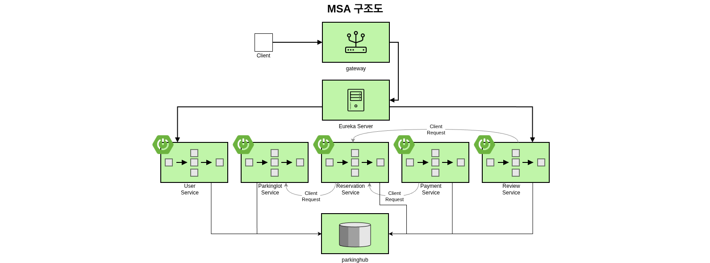

### Beyond SW 21th 2번째 단위 프로젝트

# 차곡🚘차곡🌾 (주차장 예약 시스템)

차곡차곡은 도시 내 부족한 주차 공간 문제를 해결하기 위해 설계된 **주차장 실시간 예약·조회 시스템**이다.
사용자는 주변 주차장을 검색하고, 요금정보를 확인한 뒤, 예약·결제까지 한 번에 처리할 수 있다.
또한 이용 후 리뷰를 작성해 다른 사용자에게 주차장 품질 정보를 제공한다.

***

## 팀원 정보

| 이름 | GitHub 아이디 | 프로필 링크 |
|------|----------------|--------------|
| 이형욱 | danielhw99 | https://github.com/danielhw99 |
| 이하경 | fijitlwkr | https://github.com/fijitlwkr |
| 정하경 | hathang16 | https://github.com/hathang16 |
| 이상준 | Ongsaem0 | https://github.com/Ongsaem0 |
| 이건우 | guntinue | https://github.com/guntinue |

***

## 주요 기능

### 1. 유저(User)

* 회원가입, 로그인
* 마이페이지(예약 내역, 결제 내역, 작성 리뷰 조회)

### 2. 주차장(Parking Lot)

* 위치 기반 주차장 검색
* 상세 정보 제공

  * 남은 자리 수
  * 요금 구조
  * 운영 시간
* 리뷰 평균 별점 표시

### 3. 예약(Reservation)

* 원하는 날짜/시간 기반 예약
* 예약 취소 기능
* 이용 완료 후 리뷰 작성 가능

### 4. 리뷰(Review)

* 사용자는 특정 주차장 이용 후 리뷰 작성 가능
* 다른 사용자 리뷰 조회 가능

### 5. 결제(Payment)

* 예약금으로 결제 진행

---

## 서비스 필요성

### 도심 주차 공간 부족 문제

국토교통부 자료에 따르면, 수도권 및 주요 도심 지역은 등록 차량 대비 주차 공간이 여전히 부족한 상황이다.
실제 이용자는 목적지 주변에 주차할 수 있는 공간이 있는지 알기 어려워 **시간 낭비**, **불필요한 이동**, **교통 혼잡 증가**가 발생한다.

### 기존 서비스의 한계

현재 제공되는 주차장 정보 서비스는 **예약 기능 부재**, **실시간 잔여 자리 부족**, **리뷰 기반 품질 정보 부족** 등의 문제가 존재한다.
사용자에게 필요한 정보와 실제 경험 기반 신뢰도를 동시에 제공하는 시스템의 수요가 증가하고 있다.

---

## 유사 서비스

### 카카오T 주차

* [https://parking.kakao.com](https://parking.kakao.com)
  주차장 조회·결제 기능을 제공하지만, 일부 지역에 한정되어 있거나, 리뷰 기반 품질 정보가 제한적이라는 한계가 있다.

---

## 핵심 가치

* **시간 절약**: 목적지 주변 주차장을 미리 확인하고 예약 가능
* **신뢰성**: 사용자 리뷰 기반으로 주차장 품질 정보 제공
* **편의성**: 검색 → 예약 → 결제 → 리뷰까지 원스톱 프로세스
* **투명성**: 요금 정보/운영 시간/자리 현황을 명확하게 제공

---

## MSA 구조도
> 
